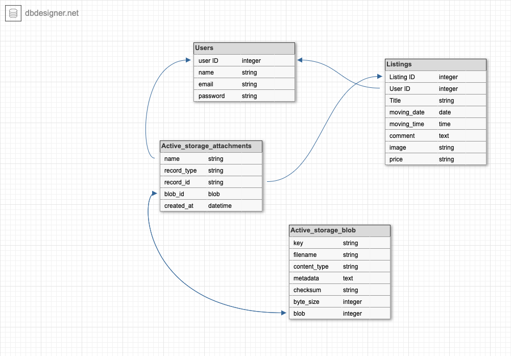
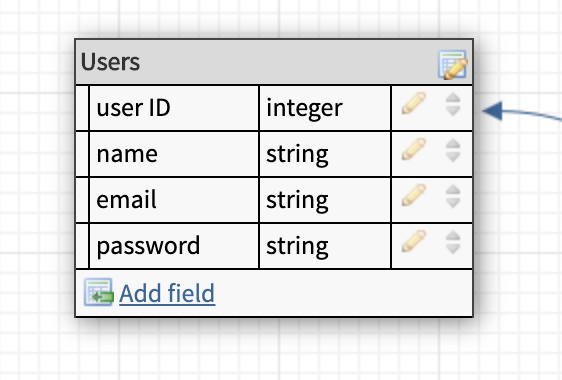

## Problem

One of the most dreaded days is moving day.  All the packing and wishing you didn't own so many things. Then theres the cost.  Hiring movers and a van can become very expensive.  When you have a community that can help you, then moving can go much smoother.  Friends and family will help you move and are happy with payment in the form of a large pizza.  This convenience is not always the case when someone does not live near their community of family and friends who can help them move.   Creating an online community of others willing to help move, pack or even share supplies, helps solve this problem.  

### Why does this problem need solving

Moving house and apartment is a part of life that will always be there.  The stress and complications of moving only increase as life changes happen.  There is a need for this process to be made simpler for people without having to pay expensive fees for two hours or less of work.

### Deployed App
[https://immense-woodland-54662.herokuapp.com/](https://immense-woodland-54662.herokuapp.com/)

### Github Repo
[https://github.com/Jese310S/moving_app](https://github.com/Jese310S/moving_app)

## App Description

#### Purpose 
The purpose of this app is to create an online marketplace,  where people who are in need of moving assistance can connect with others who would like to help.  

#### Functionality and Features 

Create/Edit User Account: 
- users will be able to create and account and edit their own account.

Listings
- The user will be able to view all listings  
- The user will be able to make a listing that offers items (moving boxes, packing material or tools).  
- The user can create/delete their own listing 
- The user can set the price to be monetary or an item such as a large pizza or gift card.

Login:
- The user can login and logout of their account

Image Upload
- The user can upload an image to support their listing

Authentication, Validations & Authorisations
- Users cannot edit other users profiles
- When creating account password and email must be in valid format
- When uploading an image the image must be correct size and format

#### Target Audience

This marketplace app is targeted to many kinds of users.  It will help both locals and expats find a friendly online community of people willing to help others move and pack.

#### Tech Stack

- Front-end: HTML, SCSS, Bootstrap, Embedded Ruby, Javascript
- Back-end: Ruby on Rails
- Database: Postgresql
- Deployment: Heroku
- Utilities: AWS S3
- Gems : Faker, mini-magick, image_processing, will_paginate
- DevOps: Git, Github, VS Code, Lucidchart, Balsamiq

#### Sitemap

#### Screenshots

#### Wireframes

#### ERD

### Explain the different high-level components in your app

The Mover App is a marketplace app built on the ruby on rails framework.  Rails uses a model view and controller architecture.

When the user visits the site they can sign up for a new account or login.  If logging in authentications is used and the correct user profile is shown.  There is also validation in place that makes sure the user signs up with a valid email and password.  The bcrypt is then used to encrypt the password in the database. With a success sign up or listing creation a flash message is used to let the user know.  

  In order to access the content of the app users must be logged in.  Once logged in a user can create and delete listings, or edit their profile information.  The user authentication does not use a third part and is manual.

When creating a listing a user can upload an image to support their listing.  The image upload uses cloud storage with an AWS S3 bucket.  There are validations in place that prevent the user from uploading files that are too large or in the wrong format.  With the creation of a successful listing the user stays on their home page.  A updated  listing feed is shown to the right of the listing form.  A User can delete a listing from their home page.  To view and individual listing the user can click the listing title .  A user can also view other users but authorisations do not allow the current user to edit another users profile.

### Third Party Services

AWS S3:  This is a public cloud storage service provided by Amazon Web Services. Amazon S3 buckets store objects which consist of data and in this case our images.

Bootstrap:  Is a framework that helps users design responsive  websites faster and easier.  It includes design templates for typography, forms, buttons, tables and much more.  It also offers support for Java script plugins.
 
Faker:  Is a part of the ruby gem network.  It generates fake data to populate the website with fake data.  Faker comes with many options and varieties of data.  This is useful when a website need to be shown and the feature look better when populated.

Gravatar:   is a third party service that will provide filler avatar images for users.  Like faker this is useful for visualising the layout of an app.

bcrypt:  Is a hash algorithm designed to encrypt passwords into hashes.  lt provides a simple wrapper for safely handling passwords.
 
mini-magick:  Is an interface between the ImageMagick program and the Ruby cod.  It helps apply all sorts of transformations to images.

image_processing:  Provides a higher level of image processing helpers methods that are needed when handling images.  It can process images with ImageMagick.

## Database

### Active Record Model Relationships

User:
- Has many listings

Listing:
- Has many users
- Has one image

### Discuss the database relations to be implemented in your application

The User schema has one relation which is listings. A user can have many listings. The user id is also the foreign key in the listings table.

A listing belongs to one user.  With the user id as a foreign the tables are linked.  a listing can also have one image.

The active storage tables are there for image upload.  A user can have many listings and a listing can have one image.  the foreign key can depend on the image.  if the image is an avatar the user_id is used.  In this app the image is used for the listing so the listing_id is used.

### Task Tracking

For this project I used trello for tracking and a homemade kanban board.

